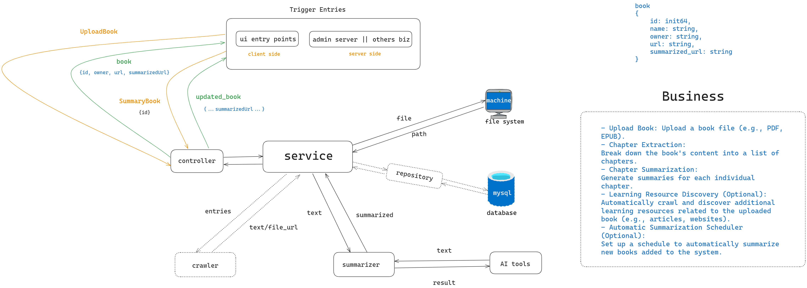

## `Home Test`
### Book Chapters Summary (fom andynghi@gmail.com)
Book summarizer:
1. There is a book with 20 chapters, content in the file `TheArtOfThinkingClearly.txt` here: https://drive.google.com/file/d/1J5b4HCwGiRSy7Lwi8Nu3jLUWtwFCshSR/view?usp=sharing

2. Requirement: Write a Golang program using OpenAI API to summary content of each chapter and combined them to a file TheArtOfThinkingClearly_Summary.txt, expected content of the file:

```
Summary of Chapter 1:
<summary content>

Summary of Chaper 2:
<summary content>

....
```


Notes:
1. Make the code able to summarize all 20 chapters as fast as possible.
2. Write the code with production quality. Suggestions: have Readme.txt, have an executable script `bin/setup` that is able to install dependencies and/or compile the code and then run your unit test suite. And `bin/summary_book TheArtOfThinkingClearly.txt` should run the program itself.
3. Considering this is a competition contest, please finish your code as fast as possible, there are about 10 people doing this. We will celebrate top guys who finish early with high quality code.
4. If you are new to Golang, the book https://www.gopl.io/ is a great place to start, contact me if you need a copy.
5. I will catch up and maybe pair coding with you if you don't know how to start or are stuck somewhere.
6. You can use this OPENAI_API_KEY: xxxxxx


### Local Development
- Main package: app/main.go
## `Solution (taibn, taibui-eh)`
- Please take a look at my idea and how I resolved the problem.
- Feel free to add comments if you have any.
- Thank you for your support. The to-do list will be completed as soon as possible.


## 1. Problem:

- Summarize Book Chapters (or "Generate Book Chapter Summaries")
- Export Results to a File
- Allow Users to View the Book on the Client-Side

## 2. Solution

- Allow users to submit books to learning resources.
- Use an AI tool to summarize specific books.
- Automatically crawl learning resources (e.g., books) and save them to the system (optional).
- Automatically run summaries from the system (optional)

## 3. Workflow

## 4. Architecture



## 5. Todo List:
- [ ] Allow concurrency up to n (configurable, default n=5) requests to OpenAI, to prevent hitting OpenAI's rate limiter. The reason is that sometimes we have a book with hundreds of chapters, and we need to limit concurrent requests to OpenAI.
- [ ] Replace openAI lib to openAI github lib
- [ ]  fix duplicate upload file: compare checksum
- [ ]  can adapt different book format
    - [ ]  fix word based format
    - [ ]  support multi formats
- [ ]  thirty party service:
    - [ ]  call multi external services: local LM studio, openAI API
- [ ]  handle large book
    - [ ]  worker tasks, concurrent tasks
- [ ]  support more middleman, validate request, handle errors, stantify request payload, normalied output
- [ ]  unit test
- [ ]  logging, cmts
- [ ]  coding stye control
- [ ]  add workflow into doc.
- [ ]  save book items to database (optional)
- [ ]  auto crawl many book (optional)
- [ ]  auto summary books (optional)

## 6.Evaluation/Improvements
